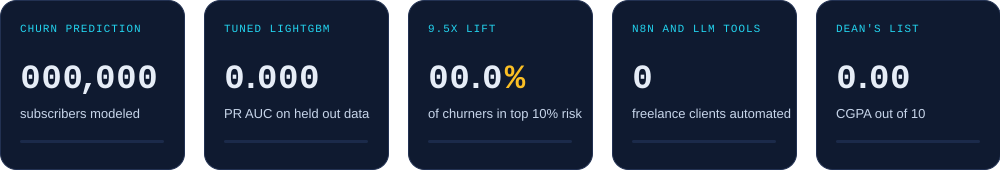
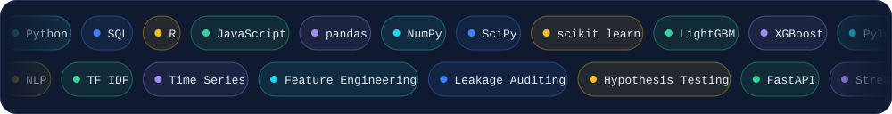

## 👋 Hi, I am Harish

I study Data Science and Economics at Krea University (CGPA 8.94, Dean's List, Class of 2027). I like problems where messy data turns into a decision: who will churn, which complaint needs attention first, what a customer buys next. I learn by building, I ship things you can click on, and I am looking for an internship where I can learn fast and earn my place on a real team.

## 🚀 Featured work

<table>
<tr><td width="50%" align="center"> <a href="https://github.com/S-Harish-Dev/KKBox-s_Churn_Prediction">Code</a></td><td width="50%" align="center"> <a href="https://financial-complaint-riskintelligence.streamlit.app/">Live demo</a> | <a href="https://github.com/S-Harish-Dev/Financial_Complaint_Risk_Intelligence">Code</a></td></tr>
<tr><td width="50%" align="center"> <a href="https://quant-engine.streamlit.app/">Live demo</a> | <a href="https://github.com/S-Harish-Dev/QUANT-ENGINE">Code</a></td><td width="50%" align="center"> <a href="https://instacart-customer-purchase-analysis.streamlit.app/">Live demo</a> | <a href="https://github.com/S-Harish-Dev/Instacart-Market-Basket-Analysis-Dataset">Code</a></td></tr>
<tr><td width="50%" align="center"> <a href="https://github.com/S-Harish-Dev/University_cost_outcome_analysis">Code</a></td><td width="50%" align="center"> <a href="https://oncampus-b1ff5.web.app/app">Live demo</a></td></tr>
</table>

## 🧰 Toolbox

## 🧪 More builds

* [Multi Disease Prediction](https://github.com/S-Harish-Dev/Multi_Disease_Prediction_Webpage): Parkinson's, diabetes and heart disease prediction in one Streamlit app
* [Diabetes ML API](https://github.com/S-Harish-Dev/Diabetes_API): a machine learning model served as an API and deployed on Heroku
* [Movie Recommender](https://github.com/S-Harish-Dev/Movie_Recommendations_Content_Based): content based recommendations using the IMDB API
* [Job Tracker](https://github.com/S-Harish-Dev/Job_Tracker_v1): an n8n workflow that extracts job details and processes them with AI

## 📍 Right now

* 🛠️ **Building:** LLM automations and ML dashboards for freelance clients
* 🎓 **Studying:** Data Science and Economics at Krea University
* 🔎 **Looking for:** Data Science and ML internships where I can learn fast and ship

